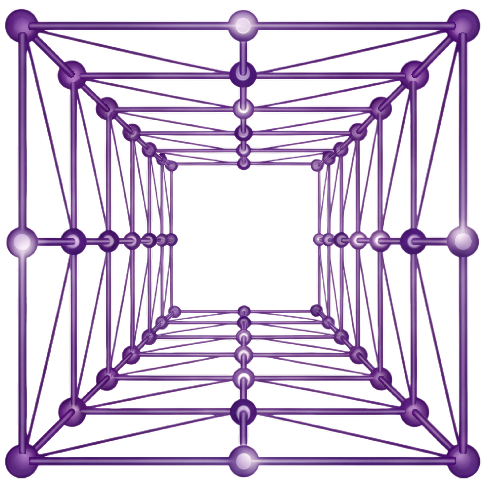
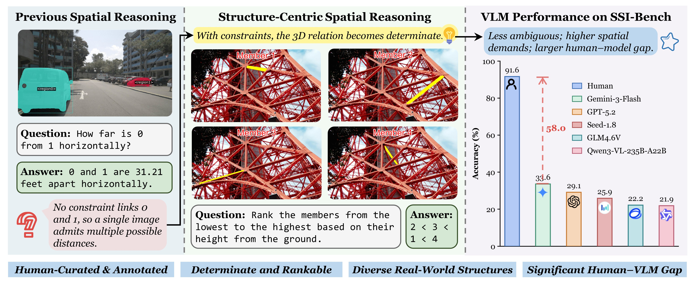

<div align="center">



<h1>Thinking in Structures: Evaluating Spatial Intelligence through Reasoning on Constrained Manifolds</h1>

<p align="center">
  Chen Yang, Guanxin Lin, Youquan He, Peiyao Chen, Guanghe Liu, Yufan Mo, Zhouyuan Xu, Linhao Wang, Guohui Zhang, Zihang Zhang, Shenxiang Zeng,
  Chen Wang&dagger;, Jiansheng Fan&dagger;
</p>

<p align="center"><sup>&dagger;</sup>Corresponding authors</p>

<p align="center">Tsinghua University</p>

<p align="center">
  <a href="https://ssi-bench.github.io/" target="_blank" rel="noopener noreferrer" style="text-decoration:none"></a>
  <a href="https://arxiv.org/pdf/2602.07864" target="_blank" rel="noopener noreferrer" style="text-decoration:none"></a>
  <a href="https://arxiv.org/abs/2602.07864" target="_blank" rel="noopener noreferrer" style="text-decoration:none"></a>
  <a href="https://huggingface.co/datasets/cyang203912/SSI-Bench" target="_blank" rel="noopener noreferrer" style="text-decoration:none"></a>
</p>

</div>

## News
- 🔥 [2026-2-10]: We released our paper, benchmark, and evaluation codes.

## Introduction
We introduce SSI-Bench, constructed from complex real-world 3D structures with feasible configurations tightly governed by geometric, topological, and physical constraints.



## Leaderboard
| Model | Avg. (%) | Type |
|---|---:|---|
| Human Performance | 91.60 | Baseline |
| Gemini-3-Flash | 33.60 | Proprietary |
| Gemini-3-Pro | 29.50 | Proprietary |
| GPT-5.2 | 29.10 | Proprietary |
| Gemini-2.5-Pro | 26.10 | Proprietary |
| GPT-5 mini | 25.90 | Proprietary |
| Seed-1.8 | 25.90 | Proprietary |
| GPT-4o | 22.60 | Proprietary |
| GPT-4.1 | 22.40 | Proprietary |
| Gemini-2.5-Flash | 22.30 | Proprietary |
| GLM-4.6V | 22.20 | Open-source |
| Qwen3-VL-235B-A22B | 21.90 | Open-source |
| GLM-4.5V | 21.40 | Open-source |
| GLM-4.6V-Flash | 21.10 | Open-source |
| Qwen3-VL-4B | 20.70 | Open-source |
| InternVL3.5-30B-A3B | 20.70 | Open-source |
| Qwen3-VL-30B-A3B | 20.60 | Open-source |
| Llama-4-Scout-17B-16E | 20.60 | Open-source |
| Gemma-3-27B | 20.50 | Open-source |
| InternVL3.5-8B | 20.20 | Open-source |
| Claude-Sonnet-4.5 | 19.90 | Proprietary |
| Gemma-3-4B | 19.70 | Open-source |
| Qwen3-VL-8B | 19.20 | Open-source |
| Qwen3-VL-2B | 19.20 | Open-source |
| InternVL3.5-38B | 19.00 | Open-source |
| InternVL3.5-241B-A28B | 18.30 | Open-source |
| InternVL3.5-14B | 17.90 | Open-source |
| Gemma-3-12B | 17.30 | Open-source |
| LLaVA-Onevision-72B | 17.20 | Open-source |
| InternVL3.5-4B | 16.80 | Open-source |
| LLaVA-Onevision-7B | 16.50 | Open-source |
| Random Guessing | 12.85 | Baseline |
| InternVL3.5-2B | 11.10 | Open-source |

## Installation
```bash
git clone https://github.com/ccyydd/SSI-Bench.git
cd SSI-Bench
```

We recommend using conda and creating **two environments**:

- Environment A (default): for most models

```bash
conda create -n ssi-bench python=3.10 -y
conda activate ssi-bench
pip install -e .
```

- Environment B (high-version): for **Qwen3-VL** and **GLM-4.6V** series (requires newer `transformers` / `vllm`)

```bash
conda create -n ssi-bench-high python=3.10 -y
conda activate ssi-bench-high
pip install -e .
pip install -r requirements_glm_4_6v.txt
pip install "transformers>=5.0.0rc0"
```

## Load Dataset
```python
from datasets import load_dataset
import os

ds = load_dataset("cyang203912/SSI-Bench")["test"]
print(ds)

output_dir = "./images"
os.makedirs(output_dir, exist_ok=True)

for ex in ds:
    index_val = ex["index"]
    images = ex["image"]     
    question = ex["question"]
    answer = ex["answer"]
    annotation_color = ex["annotation_color"]
    category = ex["category"]
    task = ex["task"]

    image_paths = []
    if images is not None:
        if not isinstance(images, list):
            images = [images]

        for n, img in enumerate(images):
            image_path = os.path.join(output_dir, f"{index_val}_{n}.jpg")
            img.save(image_path)
            image_paths.append(image_path)

    print(f"index: {index_val}")
    print(f"image: {image_paths}")
    print(f"question: {question}")
    print(f"answer: {answer}")
    print(f"annotation_color: {annotation_color}")
    print(f"category: {category}")
    print(f"task: {task}")
    print("-" * 50)
```

## Evaluation
The evaluation pipeline is implemented with <a href="https://github.com/open-compass/VLMEvalKit" target="_blank" rel="noopener noreferrer">VLMEvalKit</a>.

Download the <a href="https://huggingface.co/datasets/cyang203912/SSI-Bench/tree/main" target="_blank" rel="noopener noreferrer">TSV file</a> into `$LMUData` (default: `$HOME/LMUData`, unless set explicitly). If you can't locate `$LMUData`, run the subsequent commands first; the error message will indicate the expected path.

### API Models
Rename `template.env` to `.env` and update `API_KEY` / `API_BASE`.

Run evaluation for API models, e.g.:
```bash
python run.py --config configs/gemini_3_pro.json
```

### Hugging Face Models
To evaluate Hugging Face models:

1. Open the corresponding config in `configs/*.json`.
2. Set `model_path` to your local checkpoint path (replace `path/to/your/model`).
3. Run evaluation, e.g.:

```bash
python run.py --config configs/internvl3_5_38b.json
```

Tip: to reuse previous evaluation results, add `--reuse` when running `python run.py`. For more available arguments, please refer to the <a href="https://github.com/open-compass/VLMEvalKit/blob/main/docs/en/Quickstart.md" target="_blank" rel="noopener noreferrer">evaluation guidelines</a>.

## Citation
```bibtex
@article{yang2026thinking,
  title={Thinking in Structures: Evaluating Spatial Intelligence through Reasoning on Constrained Manifolds},
  author={Chen Yang and Guanxin Lin and Youquan He and Peiyao Chen and Guanghe Liu and Yufan Mo and Zhouyuan Xu and Linhao Wang and Guohui Zhang and Zihang Zhang and Shenxiang Zeng and Chen Wang and Jiansheng Fan},
  journal={arXiv preprint arXiv:2602.07864},
  year={2026}
}
```

## Acknowledgment
This repo is mainly built based on <a href="https://github.com/InternRobotics/MMSI-Bench" target="_blank" rel="noopener noreferrer">MMSI-Bench</a>.
Thanks for their great work!

## Contact
Chen Yang: cyang203912@163.com
